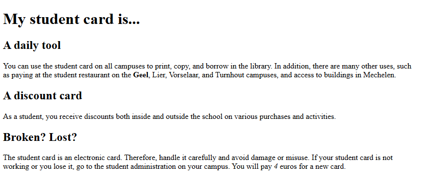
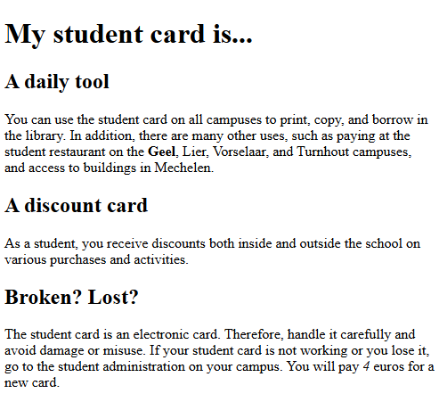
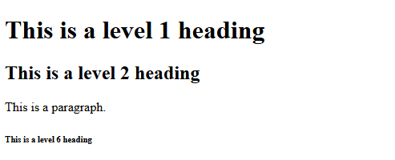

# What is HTML - Exercises

## Exercise 1

1. Open ``template.html`` in your editor. Save it as ``exercise_1.html``.

2. Complete the code so that you get the following webpage:



When you resize the browser window, you should see:



The text you need without any formatting:
```text
My student card is... 
A daily tool 
You can use the student card on all campuses to print, copy, and borrow in the library. In addition, there are many other uses, such as paying at the student restaurant on the Geel, Lier, Vorselaar, and Turnhout campuses, and access to buildings in Mechelen. 
A discount card  
As a student, you receive discounts both inside and outside the school on various purchases and activities. 
Broken? Lost?  
The student card is an electronic card. Therefore, handle it carefully and avoid damage or misuse. If your student card is not working or you lose it,  
go to the student administration on your campus. You will pay 4 euros for a new card.
```

‘**My student card is…**’ is the main title of the webpage,  
‘**A daily tool**’, ‘**A discount card**’, and ‘**Broken? Lost?**’ are level 2 headings.  
The word ‘**Geel**’ is emphasized (strong), and the number ‘*4*’ is emphasized (em).

3. Validate your solution via [http://validator.w3.org/](http://validator.w3.org/). You should not have any error messages or warnings left.


## Exercise 2

1. Browse to [http://www.antwerpen.be/](http://www.antwerpen.be/) using Chrome. View the source code. What DTD is being used here?

2. What description and/or keywords are provided to the browser?

3. Validate the webpage. Is this page valid?

4. In the code, there is something related to the favicon: `<link rel="icon" href="***/favicon/***.png" />`. Search the internet to find out what this piece of code means. Where do you see the effect of this line of code in Chrome?


## Exercise 3

1. Open ``exercise_3_start.html`` in a browser of your choice. This document was created a long time ago in HTML and still contains errors.

2. Open the document in your editor. Save it as ``exercise_3.html``. Improve the webpage so that it becomes valid XHTML 1.0 Strict. Add the correct DOCTYPE (see ``template.html``).

3. The desired end result is:



## Exercise 4

1. Open your own solution ``exercise_1.html`` in the editor. Save the document as ``exercise_4.html``.

2. Add your own name to the document so that the browser knows you are the author, but ensure that this is not visible to the user in the normal display.

3. Immediately below the author information, add a comment line to your code that includes the current date.

4. Validate your solution. You should not have any error messages or warnings left.


## Exercise 5

1. Open your own solution ``exercise_4.html`` in the editor. Save the document as ``exercise_5.html``.

2. Properly convert this document to HTML5.

3. Validate your solution. You should not have any error messages or warnings left.