# Text, images, lists - Exercises

## Exercise 1

1. Open ``exercise_1.html`` in Visual Studio Code.
2. Complete the code until you achieve the following webpage:

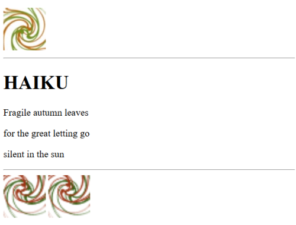

The images can be found in the exercise folder. The image at the top is ``fall1.jpg``, and the image at the bottom, which is needed twice, is ``fall2.png``.
- Always specify the dimensions for the images.
- The alternative text should always be **“autumn colors”**, and ensure that when the user hovers the mouse over the image, the text **“autumn colors”** appears as well.

3. Validate your solution via [http://validator.w3.org/](http://validator.w3.org/). You should not have any error messages or warnings.

## Exercise 2

In the exercise folder, you will find a subfolder ``images``, which contains the folders ``small`` and ``large``. You are **NOT** allowed to move the images when completing the exercise.

1. Open ``exercise_2.html`` in Visual Studio Code. Complete the page until you achieve the following result:

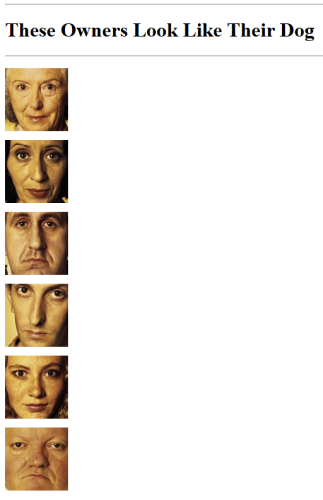

After a horizontal line, display a level 1 heading. Then display another line. Following that, list all photos of the dog owners sequentially, with alternative text: **owner 1, owner 2…**, etc.
- Always specify the dimensions for the images.
- Validate the page.

2. Open ``owner1.html`` in the editor. Complete the page until you achieve the following result:

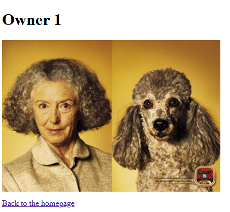

Validate the page.

3. Create analogous pages for owners 2 through 6 with the correct title, the correct image, and the correct alternative text: **owner 1 with dog, owner 2 with dog…**, and save them as ``owner_2.html``, ``owner_3.html``, etc.
- Always specify the dimensions for the images.
- Open ``exercise_2.html`` again in Visual Studio Code. Add a link to each image to allow navigation to the correct **‘Owner’** page. In Internet Explorer, a line will appear around each image indicating it is a hyperlink. Validate and test the page.

4. Open all **‘owner’** pages and create a hyperlink from the text **‘Back to the homepage’** to allow users to return to the overview page.

5. Validate and test your solution.

## Exercise 3

1. Open ``exercise_3.html`` in Visual Studio Code. In the body section, you will see a lot of text but no tags. Structure and complete the page until you achieve the following result:

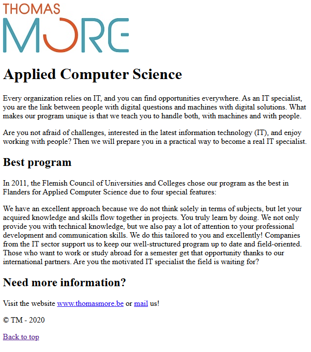

In the browser's title bar, you should see:

The logo used is ``TM_logo_white_web.jpg``, which is located in the exercise folder.
- The alternative text is **“TM logo”**.
- Specify the dimensions of the image.
- **Applied Computer Science** should be formatted as a level 1 heading, with the two subtitles as level 2 headings.

Under the title **‘More information needed’**, add:
- A link to the university’s website.
- An email link to send an email to **“info@thomasmore.be”**.
- A copyright notice.
- A **‘Back to top’** link to navigate back to the top of the page.

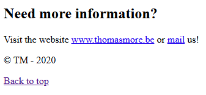

2. Validate your solution.

## Exercise 4

You can generate dummy text for a website in development using [http://www.lipsum.com/](http://www.lipsum.com/). Similarly, you can generate placeholder images until the client provides the final images. Here are a few helpful sites:
- [http://dummyimage.com/](http://dummyimage.com/)
- [http://lorempixel.com/](http://lorempixel.com/)

For this exercise, explore these tools. Open ``exercise_4.html`` in Visual Studio Code. Below is a screenshot of the page you will create:

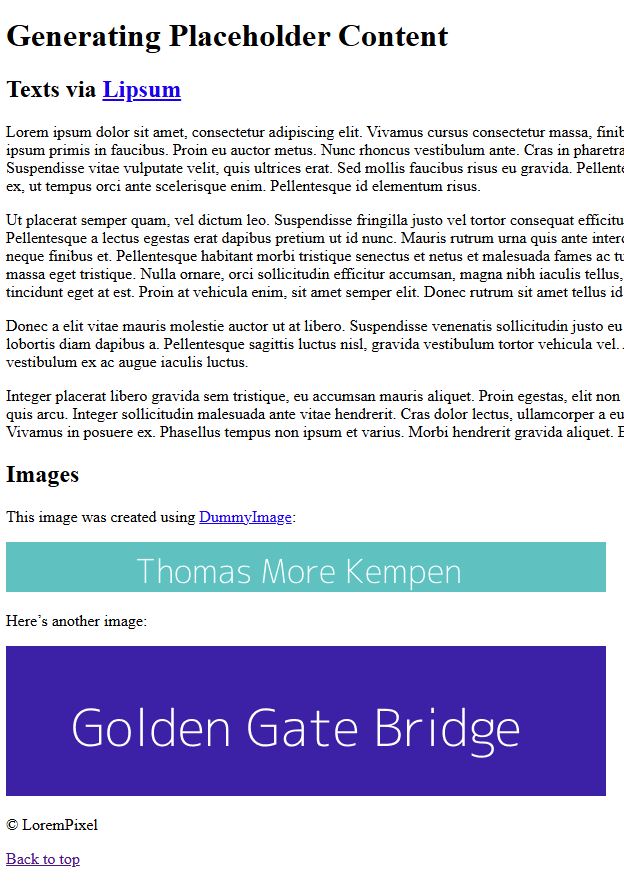

**Instructions:**
1. Add a level 1 heading: **‘Generating Placeholder Content’**
2. Add a level 2 heading: **‘Text via Lipsum’**
3. Make the word **‘Lipsum’** a link to the [lipsum.com](http://www.lipsum.com/) website.
4. Generate 4 paragraphs of text on [lipsum.com](http://www.lipsum.com/) and integrate them into your webpage in a valid way.
5. Add a level 2 heading: **‘Images’**
6. Underneath, add the text: **‘This image was created using DummyImage’**.  
7. Make the word **‘DummyImage’** a link to [dummyimage.com](http://dummyimage.com/), linking directly to the section with the unique name **‘demo’**.
8. On [dummyimage.com](http://dummyimage.com/), create an image of **600x50 pixels** with the following properties:
   - Background color: **#ec4c2f**
   - Foreground color: white
   - Text: **‘Thomas More Kempen’**
   - Save this image in the **‘images’** subfolder as **‘tmk.png’**.

9. Insert this image into your webpage in a valid way, including the correct dimensions.
10. Below the image, add the text: **‘Here’s another image:’**
11. Create an image on [lorempixel.com](http://lorempixel.com/) with the following properties:
   - **600x150 pixels**
   - Theme: **city**
   - Colored
   - Save this image in the **‘images’** subfolder as **‘city.jpg’**.

12. Add this image to your webpage in a valid way, including the correct dimensions.
13. Make the image a link to [lorempixel.com](http://lorempixel.com/).
14. Below the image, add the text: **‘© LoremPixel’**.
15. Add a **‘Back to top’** link that allows navigation to the top of the page without reloading.

Validate your solution via [http://validator.w3.org/](http://validator.w3.org/). You should not have any error messages or warnings.

## Exercise 5

1. Open ``exercise_5.html``.
2. Complete the code with a list and images until you achieve the following webpage:

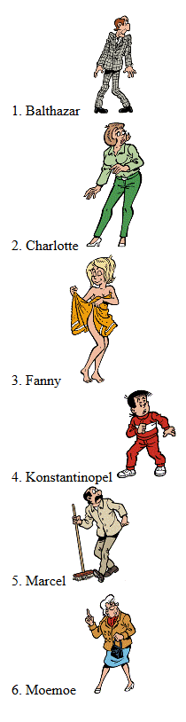

The required images are located in the ``images/kiekeboe`` subfolder. You may not move these images.
- Use the names of the comic characters as alternative text.
- Ensure these names appear as tooltips.
- Specify the dimensions of the images in your code to optimize page load time.

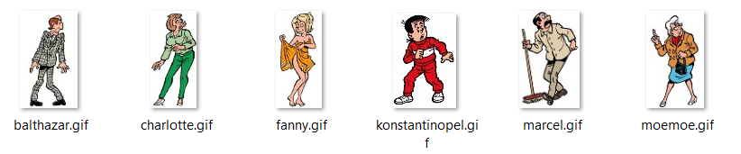

3. Validate your solution via [http://validator.w3.org/](http://validator.w3.org/). You should not have any error messages or warnings.

## Exercise 6

1. Open ``exercise_6.html``.
2. Complete the code with an image and lists until you achieve the following webpage:

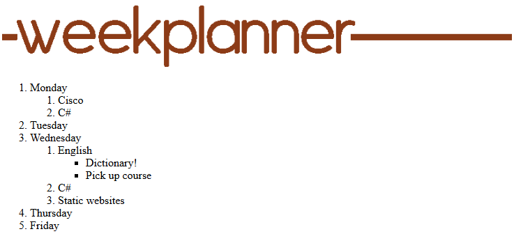

The image used is **‘weekplanner.gif’**.
- The image must always be displayed as wide as the browser window.
- The alternative text is **‘weekplanner’**.

Another example:

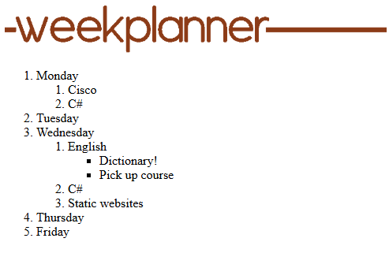

3. Validate your solution via [http://validator.w3.org/](http://validator.w3.org/). You should not have any error messages or warnings. 

## Exercise 7

1. Open ``exercise_7.html``.
2. Complete the code until you achieve the following webpage:

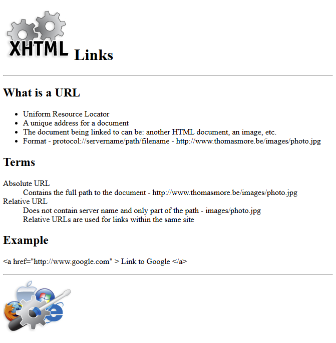

The page title is preceded by a favicon. Use **‘favicon.ico’**, which can be found in the exercise folder.

The image at the top of the page is **‘xhtml.jpg’**.
- The main title is a level 1 heading, and the three subtitles are level 2 headings.
- Specify the dimensions of the image.

Provide your own content using lists and horizontal lines.

An example of the text:

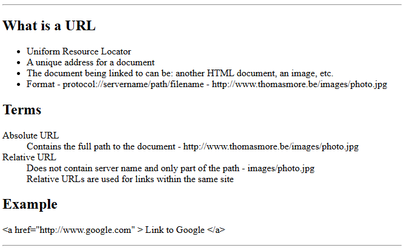

The image at the bottom of the page is **‘photo.jpg’**, and it serves as a link to **www.google.be**. Specify the dimensions of the image.

3. Validate your solution via [http://validator.w3.org/](http://validator.w3.org/). You should not have any error messages or warnings.  
