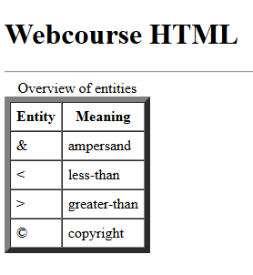
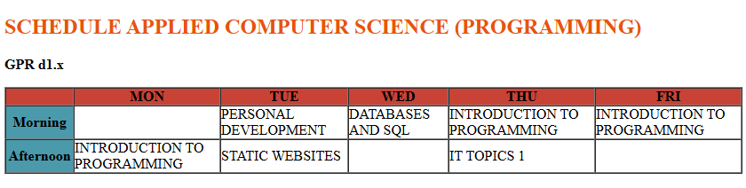
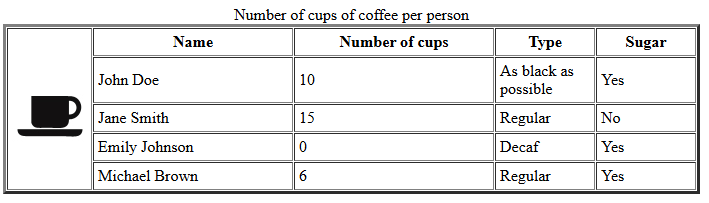
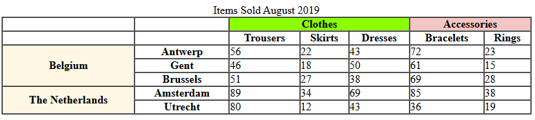
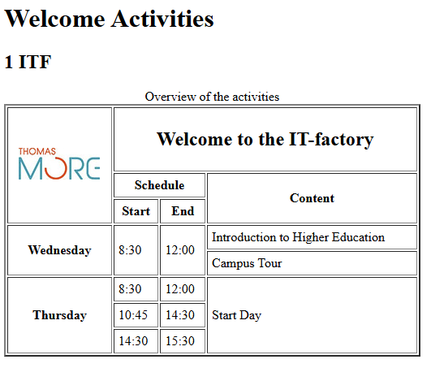

# Tables - Exercises

## Exercise 1

1. Copy the starter file `exercise_x.html` and rename it to `exercise_1.html`.  
2. Open this file in Visual Studio Code.  
3. Set an appropriate page title and fill in the meta tag "Author".  
4. Recreate the following page with a table as closely as possible: 

  

**Additional clarifications:**  
- The title **"Webcourse HTML"** is a level 1 heading.  
- The line under the title spans the full width of the browser window.  
- The table border is 6 pixels wide.  
- The space between the cells is 0.  
- The padding around the text in the cells is 6 pixels.  
- Don’t forget the table caption!  

5. Validate your solution via [http://validator.w3.org/](http://validator.w3.org/). There should be no error messages or warnings.  

## Exercise 2

1. Copy the starter file `exercise_x.html` and rename it to `exercise_2.html`.  
2. Open this file in Visual Studio Code.  
3. Set an appropriate page title and fill in the meta tag "Author".  
4. Recreate the following page with a table as closely as possible:  

  

**Additional clarifications:**  
- Assign the following attributes to the table (we will later handle this via CSS):  
  - Border around the table: 1 pixel.  
  - Space between cells: 0 pixels.  
  - Padding between text in cells and the cell border: 0 pixels.  
- Ensure that column 1 has a background color of `#009cab` and a width of 75 pixels. Solve this using `colgroup` and `col`.  
- The first row has a background color of `#dd3434`.  

5. Validate your solution via [http://validator.w3.org/](http://validator.w3.org/). You should have no errors or warnings, except for:  
   *"The xxx attribute on the TABLE element is obsolete".*  
   This will be resolved later using CSS.

## Exercise 3

1. Copy the starter file `exercise_x.html` and rename it to `exercise_3.html`.  
2. Open this file in Visual Studio Code.  
3. Set an appropriate page title and fill in the meta tag "Author".  
4. Recreate the following page with a table as closely as possible:  

  

**Additional clarifications:**  
- Image used: `coffee.jpg`.  
- Border around the table: 3 pixels wide.  
- Space between the cells: 4 pixels.  
- Padding between text in cells and the cell border: 1 pixel.  
- Column widths:  
  - First column: determined by the browser.  
  - Second and third columns: 200 pixels wide.  
  - Fourth and fifth columns: 100 pixels wide.  

5. Validate your solution via [http://validator.w3.org/](http://validator.w3.org/). You should have no errors or warnings, except for:  
   *"The xxx attribute on the TABLE element is obsolete".*  
   This will be resolved later using CSS.

## Exercise 4

1. Copy the starter file `exercise_x.html` and rename it to `exercise_4.html`.  
2. Open this file in Visual Studio Code.  
3. Set an appropriate page title and fill in the meta tag "Author".  
4. Recreate the following page with a table as closely as possible:  

  

**Additional clarifications:**  
- Border around the table: 1 pixel.  
- Space between the cells: 0 pixels.  
- Padding between text in cells and the cell border: 0 pixels.  
- All colored cells span multiple rows or columns. You can choose the colors yourself.  
- The table caption is: *"Items Sold…"*.  

5. Validate your solution via [http://validator.w3.org/](http://validator.w3.org/). You should have no errors or warnings, except for:  
   *"The xxx attribute on the TABLE element is obsolete".*  
   This will be resolved later using CSS.

## Exercise 5

1. Copy the starter file `exercise_x.html` and rename it to `exercise_5.html`.  
2. Open this file in Visual Studio Code.  
3. Set an appropriate page title and fill in the meta tag "Author".  
4. Recreate the following page with a table as closely as possible:  

  

**Additional clarifications:**  
- The table occupies half the width of the browser window.  
- The table has 8 rows and 4 columns.  
- The table borders are 2 pixels thick.  
- The space between the cells is 0.  
- The padding around the text in the cells is 5 pixels.  
- **"Welcome activities"** is a level 1 heading.  
- **"1 ITF"** and **"Welcome to the IT-factory"** are level 2 headings.  
- In the first cell of the table, add the image `tm_logo.jpg` in a valid way, including its dimensions. The image must serve as an email link to send an email to `itf@thomasmore.be`.  

5. Validate your solution via [http://validator.w3.org/](http://validator.w3.org/). You should have no errors or warnings, except for:  
   *"The xxx attribute on the TABLE element is obsolete".*  
   This will be resolved later using CSS.