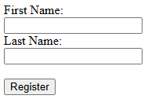
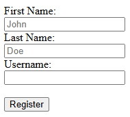
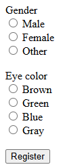
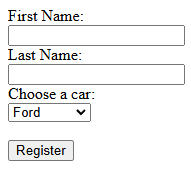
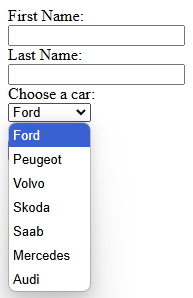
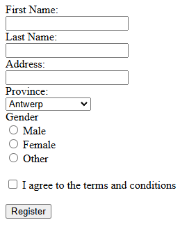

# Forms - Exercises

## Exercise 1  

1. Open the starter file `exercise_1.html` in Visual Studio Code.  
2. Recreate the following form as closely as possible:  

  

**Additional clarifications:**  
- The method for submitting the form data is **POST**.  
- Redirect to `register.php` (you do not need to create this page).  

3. Validate your solution via [http://validator.w3.org/](http://validator.w3.org/). There should be no error messages or warnings.  

## Exercise 2  

1. Open the starter file `exercise_2.html` in Visual Studio Code.  
2. Recreate the following form as closely as possible:  

  

**Additional clarifications:**  
- The method for submitting the form data is **GET**.  
- Redirect to `register.php` (you do not need to create this page).  
- The fields "John" and "Doe" are placeholders.  

3. Validate your solution via [http://validator.w3.org/](http://validator.w3.org/). There should be no error messages or warnings.  

## Exercise 3  

1. Open the starter file `exercise_3.html` in Visual Studio Code.  
2. Recreate the following form as closely as possible:  

  

**Additional clarifications:**  
- The method for submitting the form data is **GET**.  
- Redirect to `register_user.php` (you do not need to create this page).  
- Only one option can be selected for gender, and only one option for eye color.  

3. Validate your solution via [http://validator.w3.org/](http://validator.w3.org/). There should be no error messages or warnings.  

## Exercise 4  

1. Open the starter file `exercise_4.html` in Visual Studio Code.  
2. Recreate the following form as closely as possible:  

   

**Additional clarifications:**  
- The method for submitting the form data is **POST**.  
- Redirect to `register.php` (you do not need to create this page).  

3. Validate your solution via [http://validator.w3.org/](http://validator.w3.org/). There should be no error messages or warnings.  

## Exercise 5  

1. Open the starter file `exercise_5.html` in Visual Studio Code.  
2. Recreate the following form as closely as possible:  

  

**Additional clarifications:**  
- The method for submitting the form data is **GET**.  
- Redirect to `register.php` (you do not need to create this page).  
- Populate the "province" dropdown menu with all provinces of Belgium.  

3. Validate your solution via [http://validator.w3.org/](http://validator.w3.org/). There should be no error messages or warnings.  
