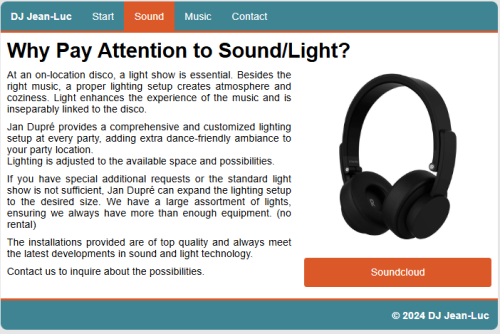
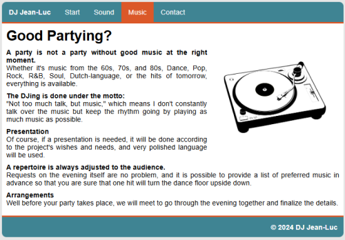
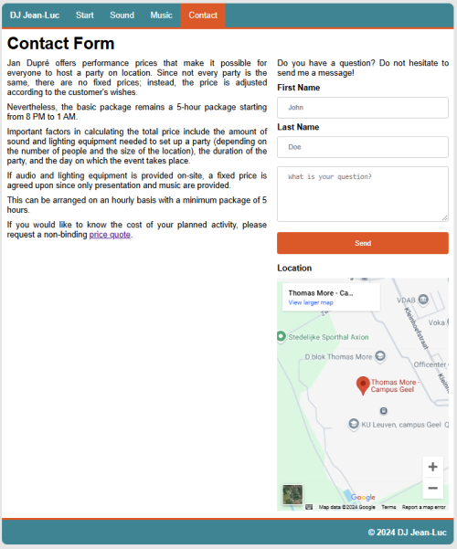

# What is CSS - Exercises

## Exercise 1

DJ Jean-Luc, a well-known DJ from the quiet Kempen, quickly sets the mood for both big and small parties. As Jean-Luc always says: the roof must come off! Unfortunately, the entertainment industry has been heavily affected by the COVID-19 pandemic, so Jean-Luc thought about launching a website to better promote himself online. He has already sent over some photos and texts for the various pages.

### Homepage  

  

**Additional information:**  
- The container has a width of **70%** and is centered.  
- The background color of the body is **#e6e6e6**.  
- The background color of the container is **#fff**.  
- The blue color code is **#008693**, and the orange color code is **#f04c25**.  

### Sound  

  

**Additional information:**  
- When the user clicks the **Soundcloud** button, redirect them to a Soundcloud link of your choice. Make sure to open it in a new tab!  
- When this page is viewed on a smartphone, the columns should stack on top of each other.  

### Music  

  

### Contact  

  

**Additional information:**  
- When this page is viewed on a smartphone, the columns should stack on top of each other.  
- When the user clicks the link to the **quote**, redirect them to a PDF that you quickly create.  
- Set **Thomas More Geel** as the location.