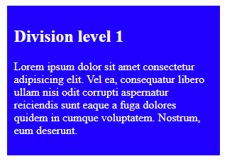
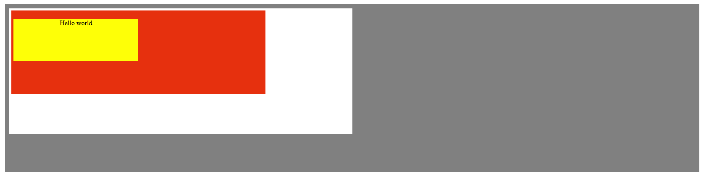
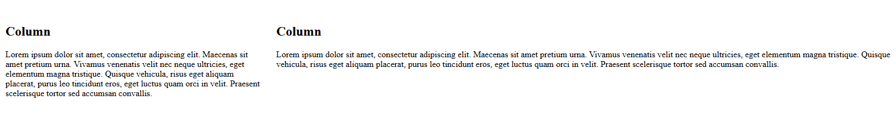
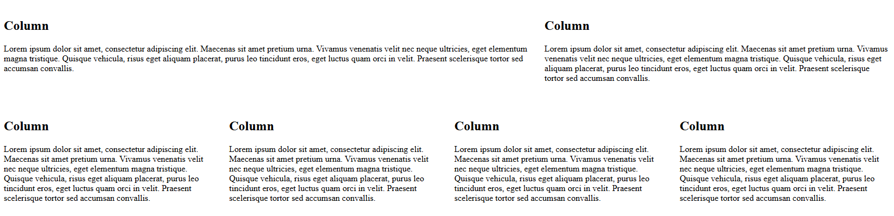
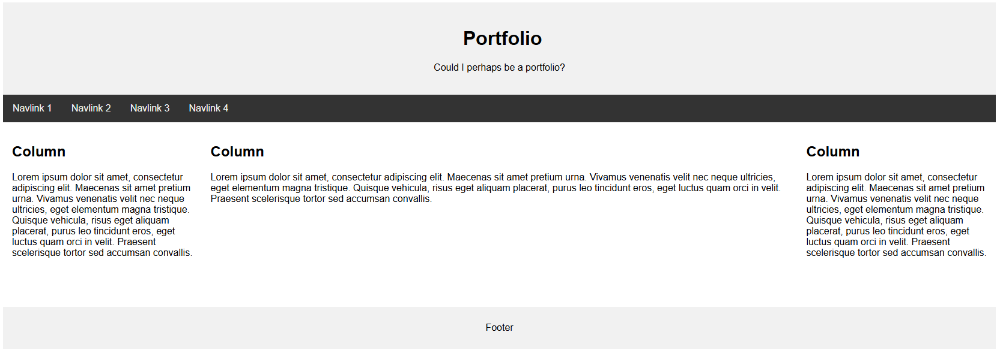

# What is CSS - Exercises

## Exercise 1  

1. Open the starting file `index.html` in Visual Studio Code.
2. Try to replicate the following result as accurately as possible.

  

**Additional information:**  
- The div has a width of **300px**, a padding of **10px**, and is centered.  
- Tip: Search for ‘margin: auto’.  
3. Validate your solution via [http://validator.w3.org/](http://validator.w3.org/), and ensure there are no error messages or warnings.  

## Exercise 2  

1. Open the starting file `index.html` in Visual Studio Code.
2. Try to replicate the following result as accurately as possible.

  

**Additional information:**  
- The yellow div has a height of **100px** and a width of **50%**.  
- The red div has a height of **200px**, a width of **75%**, and a padding of **5px**.  
- The white div has a height of **300px**, a width of **50%**, and a padding of **5px**.  
3. Validate your solution via [http://validator.w3.org/](http://validator.w3.org/), and ensure there are no error messages or warnings.  

## Exercise 3  

1. Open the starting file `index.html` in Visual Studio Code. 
2. Try to replicate the following result as accurately as possible.

  

**Additional information:**  
- The first column has a width of **30%** and a padding of **15px**.  
- The second column has a width of **70%** and a padding of **15px**.  
- When the screen is smaller than **600px**, the columns should take up the full width of the screen.  
3. Validate your solution via [http://validator.w3.org/](http://validator.w3.org/), and ensure there are no error messages or warnings.  

## Exercise 4  

1. Open the starting file `index.html` in Visual Studio Code.
2. Try to replicate the following result as accurately as possible.

  

**Additional information:**  
- The first row has two columns, one with a width of **60%** and the other **40%**, both with a padding of **15px**.  
- The second row has four columns with a width of **25%** and a padding of **15px**.  
- When the screen is smaller than **500px**, the columns should take up the full width of the screen.  
3. Validate your solution via [http://validator.w3.org/](http://validator.w3.org/), and ensure there are no error messages or warnings.  

## Exercise 5  

1. Open the starting file `index.html` in Visual Studio Code.
2. Try to replicate the following result as accurately as possible.

  

**Additional information:**  
- Use four divs named: **header**, **navigation**, **content**, and **footer**.  
- As you can see, the **header** and **footer** divs span the full width of the screen.  
- You can choose the width for the **navigation** and **content** divs.  
- The **navigation** div has a height of **500px**.  
- The padding for all four divs is set to **5px**.  
- Find a photo of the **London Bridge** and place it in the **content** div. Make sure the photo is not too large (up to **350kb** is acceptable), as larger images will slow down the website's loading time!  
- Tip: Use `body { margin: 0px }` to remove white borders.  
3. Validate your solution via [http://validator.w3.org/](http://validator.w3.org/), and ensure there are no error messages or warnings.  

## Exercise 6  

1. Open the starting file `index.html` in Visual Studio Code.
2. Try to replicate the following result as accurately as possible.

  

In this exercise, you have full freedom, but make sure the three columns stack on top of each other when the page is viewed on a smaller screen.  
3. Validate your solution via [http://validator.w3.org/](http://validator.w3.org/), and ensure there are no error messages or warnings.  
