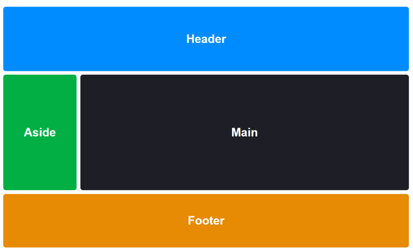

# Position, grid & flexbox - Exercises

### Exercise 1  

1. Open the starting file `exercise_x.html` in Visual Studio Code.  
2. Try to replicate the following page as accurately as possible.

  

**Additional information:**
- The image `compass.jpg` is a background image.  
- The divs (labels) should have a nice handwritten font. Search for a fun font via Google Fonts.  
- Create 4 classes (north, south, etc.) and give them the appropriate positioning.  
**Challenge:**  
- Try to find out how to use the `transform translate()` function to center the labels exactly.  
3. Validate your solution via [http://validator.w3.org/](http://validator.w3.org/), and ensure there are no error messages or warnings.  

### Exercise 2  

1. Open the starting file `exercise_x.html` in Visual Studio Code.  
2. Try to replicate the following page as accurately as possible.

  

**Additional information:**  
- Look online for information on how the **grid-template-areas** property works.  
- Use the following tags: **header**, **aside**, **main**, and **footer**.  
- Link these tags to the areas.  
- We have 2 columns and 3 rows:  
  - **Aside** is **200px**, and **main** is set to **auto**.  
3. Validate your solution via [http://validator.w3.org/](http://validator.w3.org/), and ensure there are no error messages or warnings.  
